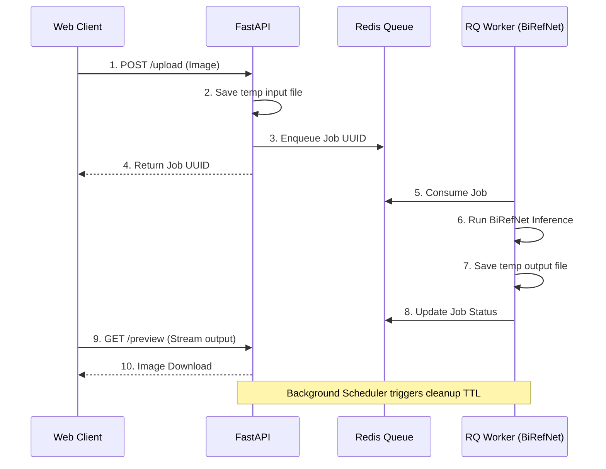

<div align="center">
  
  # 🪄 CleanBG

  **Privacy-First AI Background Removal Platform**

  [](#)
  [](#)
  [](#)
  [](#)
  [](#)

</div>

<br />

CleanBG is an enterprise-grade, privacy-first web application that instantly removes image backgrounds using state-of-the-art AI (BiRefNet). It features a completely zero-retention data pipeline—guaranteeing that your original and processed images are automatically purged from the server SSD the moment you download them.

## ✨ Features

- **🧠 State-of-the-Art AI**: Powered by [BiRefNet](https://github.com/ZhengPeng7/BiRefNet) via PyTorch for pixel-perfect subject segmentation.
- **🔒 Zero-Retention Privacy**: Uploads are ephemeral. Processed outputs are temporary. The PostgreSQL database stores strictly job metadata (UUIDs and timestamps), never image blobs.
- **⚡ Hardware Accelerated UI**: The frontend utilizes a zero-render React image comparison slider operating at 60 FPS via Framer Motion's `translate3d(0,0,0)`.
- **☁️ Cloud Agnostic Deployment**: Architected to deploy on anything from a high-end AWS GPU cluster down to a free Oracle Cloud ARM64 CPU instance.
- **🚀 Distributed Job Queue**: Heavy AI inference is cleanly separated from the web thread using Redis and Celery/RQ workers.

## 🏗️ Architecture


*(For a deeper dive, read the [Architecture Guide](./docs/ARCHITECTURE.md))*

## 🚀 Quickstart (Local Development)

The entire platform is orchestrated via Docker Compose. You do not need to install Python, Node, PostgreSQL, or Redis on your host machine.

### Prerequisites
- [Docker Engine](https://docs.docker.com/engine/install/) and [Docker Compose](https://docs.docker.com/compose/install/)

### 1. Clone & Configure
```bash
git clone https://github.com/yourusername/cleanbg.git
cd cleanbg

cp .env.local.example .env.local
cp backend/.env.example backend/.env
```

### 2. Boot the Stack
```bash
docker compose -f docker-compose.dev.yml up --build
```

### 3. Access the App
- **Web UI**: `http://localhost:3000`
- **FastAPI Docs**: `http://localhost:8000/docs`

## 🌍 Production Deployment

CleanBG is fully prepared for production deployments with multi-stage Dockerfiles, Nginx reverse proxy configurations, and strict security headers. 

- Deploying to Oracle Cloud Always Free (ARM64)? Read our [Oracle Deployment Guide](./docs/ORACLE_DEPLOYMENT.md).

## 📚 Documentation
- [API Reference](./docs/API.md)
- [Architecture & Privacy](./docs/ARCHITECTURE.md)
- [Image Slider Engineering](./docs/ImageComparisonSlider.md)

## 📄 License
This project is licensed under the MIT License - see the LICENSE file for details.
