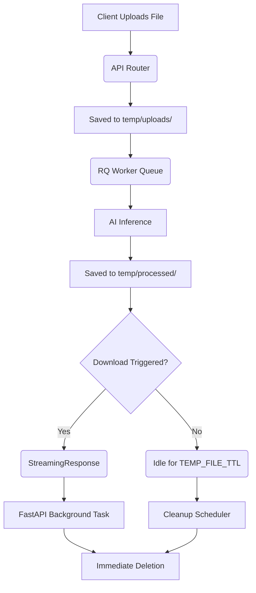

# File Lifecycle

The CleanBG temporary storage pipeline ensures that resources are efficiently allocated and rapidly deallocated to minimize disk usage and protect user privacy.

## Process Flow

## Atomic Cleanup Phases

1. **Job Success**: Input, output, and thumbnail files are queued for deletion *immediately* after the user successfully downloads the processed file via `/api/v1/jobs/download/{job_id}`.
2. **Job Failure**: If the AI model crashes or encounters an out-of-memory (OOM) error, the worker's `finally` block sweeps any temporary buffers and files generated during the pipeline.
3. **Session Abandonment**: If the user uploads a file but never polls for completion or downloads it, the `app.core.cleanup.cleanup_task` scans the `/temp` directories every 60 seconds and removes files exceeding the `TEMP_FILE_TTL` (default 5 minutes).

## Memory Management

Alongside disk cleanup, the worker explicitly deletes intermediate tensors (`del processed_img`), forces Python garbage collection (`gc.collect()`), and purges the CUDA cache (`torch.cuda.empty_cache()`) to prevent VRAM fragmentation.
