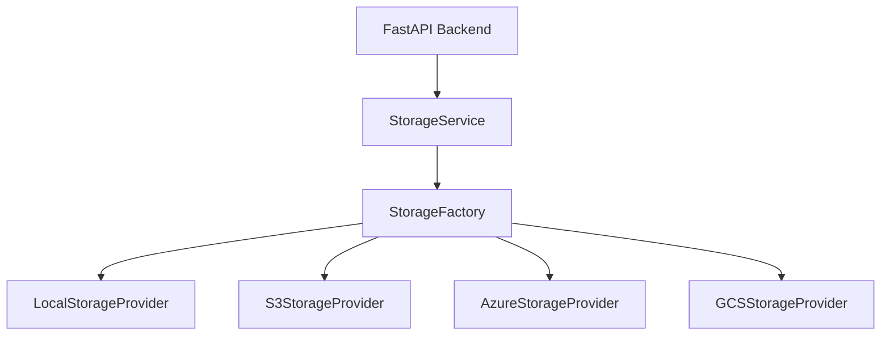

# Storage Architecture

CleanBG utilizes a robust, cloud-agnostic storage abstraction layer allowing it to seamlessly transition between local development storage and enterprise cloud providers.

## Architecture

## Configuration

The active storage provider is determined by the `STORAGE_PROVIDER` environment variable.

| Provider | Variable Value | Required Environment Variables |
| :--- | :--- | :--- |
| Local (Default) | `local` | `UPLOAD_DIR`, `PROCESSED_DIR` |
| AWS S3 | `s3` | `AWS_ACCESS_KEY_ID`, `AWS_SECRET_ACCESS_KEY`, `AWS_REGION`, `AWS_BUCKET_NAME` |
| Azure Blob | `azure` | `AZURE_STORAGE_CONNECTION_STRING`, `AZURE_CONTAINER_NAME` |
| Google Cloud | `gcs` | `GCS_PROJECT_ID`, `GCS_BUCKET_NAME`, `GOOGLE_APPLICATION_CREDENTIALS` |

## Presigned URLs

All providers support generating presigned/SAS URLs via `provider.generate_presigned_url(uri, expiration)`. This offloads download bandwidth from the backend servers directly to the CDN/Cloud Storage.
